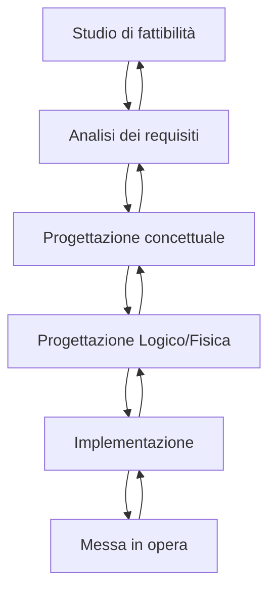

#basididati 

---

## 6.1 Introduzione alla progettazione

La progettazione di una base di dati fa parte di un contesto più ampio dello sviluppo di un singolo sistema informativo, viene definita infatti da uno *schema a cascata* (o *ciclo di vita*):

### LE FASI DI PROGETTAZIONE:
1. Lo *studio di fattibilità* consiste nell'incontro tra committente e progettista, in questa fase il cliente descrive le necessità che ricerca nella sua base di dati. È una fase in cui anche senza entrare nel dettaglio è necessario raccogliere informazioni sufficienti per capire se il lavoro può essere fatto o meno.

2. La fase successiva è l'*analisi dei requisiti*, nella quale si cerca di capire quali specifiche il committente si aspetta di avere nella sua base di dati. Queste di dividono in *funzionali* e *non funzionali*.

1. Si passa poi alla *progettazione concettuale*, dove si "elencano" le informazioni da rappresentare. Questa fase produce un **progetto concettuale** rappresentato da un **Modello Entità-Relazione**.

4. Segue la *progettazione logico/fisica* che serve a definire la struttura logica dei dati più adatta a rappresentare una determinata informazione. Si utilizza il Modello Relazionale (rappresentato da **tabelle**).

5. In conclusione *implementazione* (ovvero realizzazione del sistema informativo secondo la struttura definita nelle fasi precedenti) e *messa in opera* (cioè **validazione**, **collaudo** e **funzionamento**).

- ***NOTA***: il processo non è quasi mai sequenziale in quanto spesso, durante l'esecuzione di una delle fasi, bisogna rivedere decisioni prese nelle fasi precedenti. Si ottiene quindi un vero e proprio *ciclo* di operazioni.

### Modello Entità-Relazione

È un *modello concettuale* definito da strutture atte a descrivere la realtà di interesse in maniera comprensibile (dette *construtti*).

I costrutti vengono utilizzati per definire degli *schemi* che descrivono l'organizzazione e la struttura dei dati (detti *occorrenze*).

#### Costrutti del Modello ER

#### Costrutti principali
1. **Entità**: Rappresentano classi di oggetti che hanno proprietà comuni ed esistenza "autonoma" nel contesto dell'applicazione di interesse. Un'*occorrenza* di un'entità è un oggetto della classe che rappresenta. Ogni entità è caratterizzata da un nome che la identifica univocamente. 
2. **Relazioni**: Rappresentano legami logici tra due o più entità. Ogni relazione ha un nome che la identifica. Non ci possono essere ripetizioni di relazioni. È possibile avere *relazioni ricorsive* (ovvero relazioni tra un'entità e se stessa). È anche possibile avere relazioni che coinvolgono più di due entità (dette "n-arie").
3. **Attributi**: Descrivono le proprietà elementari di entità o relazioni, associano a ciascuna occorrenza un valore (appartenente ad un *dominio* di valori ammissibili). Alcune volte è utile raggruppare più attributi in *attributi composti*.

#### Altri costrutti
1. **Cardinalità**:
	1. delle **relazioni**:  indicano il numero minimo e massimo di occorrenze di relazione a cui un'occorrenza dell'entità può partecipare, ovvero quante volte un'occorrenza di entità può essere legata a occorrenze delle altre entità coinvolte.
	     Le più utilizzate sono:
		1. *uno a uno*: (0, 1) -> (1, 1)
		2. *uno a molti*: (1, 1) -> (0, N)
		3. *molti a molti*: (1, N) -> (0, N)
	2. degli **attributi**: indicano il numero minimo e massimom di valori dell'attributo associati a ogni occorrenza di entità o relazione.
	   **NOTA**: quando la cardinalità minima è zero indica *opzionalità*, quando invece è uno indica la partecipazione *obbligatorietà*. Cardinalità massima pari ad N indica un numero arbitrario di occorrenze.
2. **Identificatori**: Descrivono i concetti (attributi e/o entità) che permettono di *identificare univocamente* un occorrenza di entità. Gli identificatori sono sempre caratterizzati da cardinalità (1, 1). Ogni entità deve avere almeno un identificatore. 
     Possono essere:
	1. interni (o *chiavi*): Attributi *interni* all'entità
	2. esterne: Altre entità (esterne all'entità di partenza)
3. **Generalizzazioni**: Rappresentano legami logici tra una data entità *E* (genitore) e una o più entità *E1 , ... , En* (figlie). *E* sarà *generalizzazione* di *E1 , ... , En* (dette *specializzazioni* di *E*).
      Proprietà:
	1. Ogni occorrenza di un'entità figlia è anche occorrenza dell'entità genitore.
	2. Ogni proprietà dell'entità genitore appartiene anche all'entità figlia. (*ereditarietà*)
	   
	Possono essere classificate come:
	- *totali* se ogni occorrenza dell'entità genitore è occorrenza di almeno una delle'entità figlie, altrimenti sono *parziali*
	- *esclusive* se ogni occorrenza dell'entità genitore è al più un occorrenza di una delle entità figlie, altrimenti sono *sovrapposte*

**NOTA**: Cardinalità, identificatori costituiscono *vincoli di integrità* (cioè proprietà che le occorrenze devono soddisfare per poter essere considerate "valide").

*Esempio di Modello E-R:*

Alcune volte il singolo Modello E-R non fornisce tutte le informazioni necessarie per essere interpretato come si deve. Per questo motivo va corredato con una *documentazione* di supporto. Questa può essere facilmente prodotta tramite un *dizionario dei dati*, come il seguente:

